# 🚀 Distributed Saga Orchestration with Spring Boot + Kafka

A production-style event-driven microservices system implementing the **Saga Pattern** (Orchestration + Compensation) using Spring Boot and Apache Kafka for managing distributed transactions in a fault-tolerant architecture.

---

## 🧠 System Design Overview

This project demonstrates how to manage distributed transactions across multiple microservices **without** using traditional ACID transactions.

Instead, it uses:

- ✅ Saga Orchestration Pattern (central coordinator)
- 🔄 Compensating Transactions (rollback via events)
- 📡 Event-driven communication via Kafka
- 🧩 Decoupled microservices architecture

---

## 🎯 Problem Statement

In a distributed microservices system:

- Each service owns its own database
- Traditional DB transactions cannot span services
- Failures in one service can lead to inconsistent system state

**Example Problem:**

```
Order is created      ✔
Payment succeeds      ✔
Product Inventory fails ❌
→ System becomes inconsistent ❌
```

---

## 💡 Solution: Saga Pattern

This project solves the problem using **Saga Orchestration**:

- A central orchestrator controls workflow
- Each step emits Kafka events
- On failure → compensating actions are triggered

---

## 🔄 Saga Execution Flow

### 1. Happy Path (Success Flow)

```
ORDER_CREATED
   ↓
PAYMENT_PROCESSED
   ↓
PRODUCT_RESERVED
   ↓
ORDER_COMPLETED
```

### 2. Failure + Compensation Flow

```
ORDER_CREATED
   ↓
PAYMENT_PROCESSED
   ↓
PRODUCT_FAILED ❌
   ↓
COMPENSATION STARTS
   ↓
PAYMENT_REFUND_INITIATED
   ↓
ORDER_CANCELLED
```

---

## 🧩 Core Design Components

### 1. Orchestrator Service (Saga Brain)

Responsible for:

- Starting saga workflow
- Tracking state transitions
- Publishing next event
- Triggering compensations on failure

Key responsibilities:

- State machine execution
- Event coordination
- Failure recovery decisions

### 2. Microservices (Order / Payment / Product)

Each service is:

- Independently deployable
- Owns its business logic
- Listens to Kafka topics
- Emits success/failure events

> **Key principle:** "Services never talk directly — only via events"

### 3. Kafka Event Bus

Kafka acts as:

- Message backbone
- Event streaming system
- Decoupling layer between services

Benefits:

- Asynchronous processing
- High scalability
- Fault tolerance
- Replay capability

### 4. Compensating Transactions

Each service implements a forward action and a corresponding compensation:

| Service           | Action          | Compensation Action |
|-------------------|-----------------|---------------------|
| Order             | Create Order    | Cancel Order        |
| Payment           | Charge Payment  | Refund Payment      |
| Product Inventory | Reserve Stock   | Release Stock       |

---

## 🔁 State Transition Model

```
STATE: INIT
   ↓
ORDER_CREATED
   ↓
PAYMENT_SUCCESS
   ↓
INVENTORY_SUCCESS
   ↓
COMPLETED

OR (Failure Path)
   ↓
FAILED
   ↓
COMPENSATION_RUNNING
   ↓
ROLLED_BACK
```

---

## ⚙️ Technology Stack

| Technology      | Purpose                     |
|-----------------|-----------------------------|
| Java 21         | Core language               |
| Spring Boot     | Application framework       |
| Spring Kafka    | Kafka integration           |
| Apache Kafka    | Event streaming             |
| Maven           | Build tool                  |
| JSON            | Event serialization format  |

---

## 🧠 Key Design Principles

### 1. Event-Driven Architecture
Loose coupling between services via Kafka events.

### 2. Eventually Consistent System
System guarantees consistency over time, not instantly.

### 3. Failure-First Design
Every service is designed to handle retries, failures, and compensation events.

### 4. Idempotency *(Critical in real systems)*
Consumers must safely handle duplicate Kafka messages.

---

## 🧪 Fault Tolerance Strategy

This system handles:

- Service downtime
- Kafka retry scenarios
- Partial failure recovery
- Duplicate event processing

---

## 📉 Tradeoffs

**✔ Pros:**
- Highly scalable
- Decoupled architecture
- Fault tolerant
- Production-aligned design

**❌ Cons:**
- Increased system complexity
- Eventual consistency instead of immediate consistency
- Harder debugging vs. monoliths

---

## 📦 Project Structure

```
saga-system/
├── orchestrator-service/
├── payment-service/
├── order-service/
├── product-service/
└── common-events/          # Shared DTOs & event definitions
```
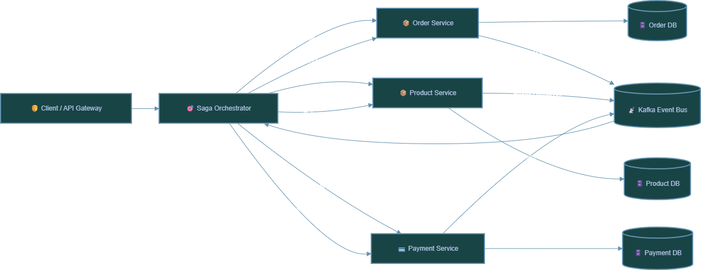


Each service contains:

- Kafka producers
- Kafka consumers
- Business logic
- Event handlers

---
## 📦 ERD
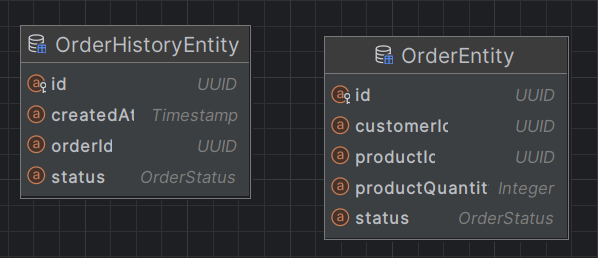
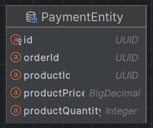
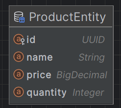

## 📦 Code Structure
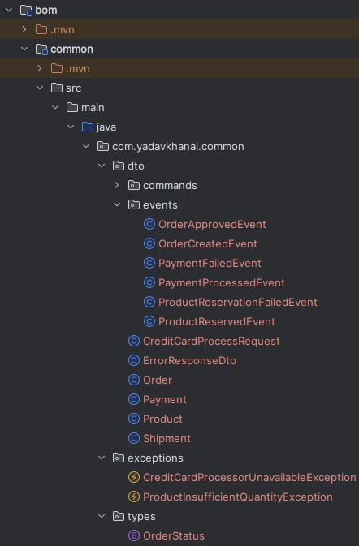
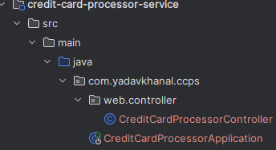
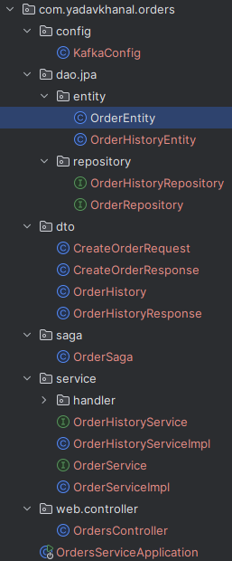
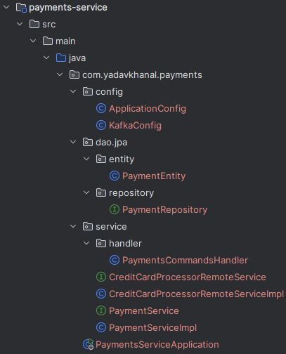
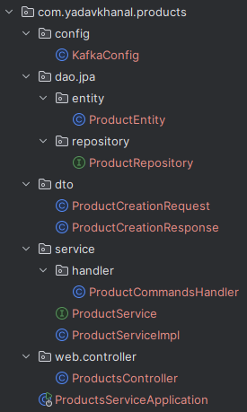

## 📦 Success Flow Transaction
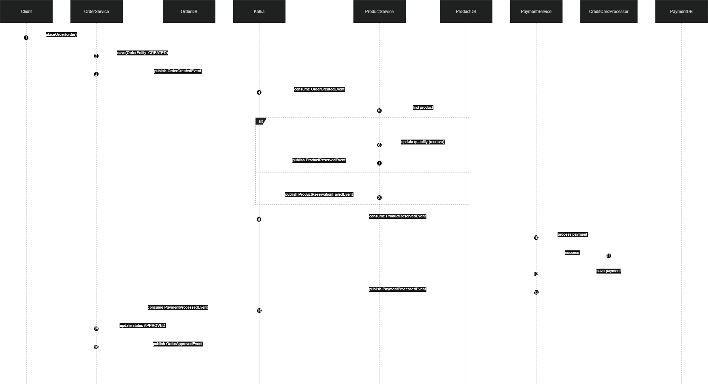

## 📦 Compensatory Transaction
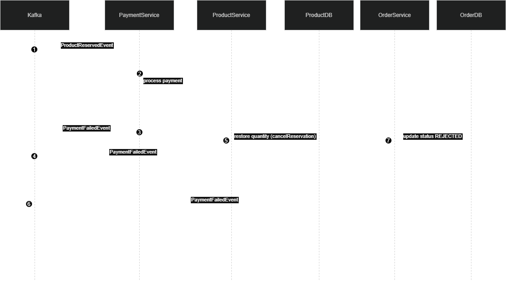

To run kafka in docker, run from the folder where the docker-compose.yml is located.
docker-compose --env-file environment.env up -d

## 🚀 Real-World Use Cases

This architecture is widely used in:

- 💳 **Banking systems** — transaction workflows
- 🛒 **E-commerce platforms** — order processing
- ✈️ **Booking systems** — flight/hotel reservations
- 🚚 **Logistics tracking systems** — shipment coordination

---

## 📈 Scalability Considerations

- Kafka partitions enable horizontal scaling
- Consumer groups allow parallel processing
- Services can scale independently

---

## 🔥 Possible Enhancements (Production Grade)

### 1. Saga State Store (DB-backed)
Track saga progress persistently across restarts.

### 2. Outbox Pattern
Ensure no event loss between the database and Kafka.

### 3. Dead Letter Topic/Queue (DLT/Q)
Handle permanently failed messages gracefully.

### 4. Observability
Add:
- Distributed tracing (OpenTelemetry)
- Metrics (Prometheus)
- Log correlation (traceId)

### 5. Schema Registry
Use Avro/Protobuf for strict contract enforcement between services.

---

## 🏁 Summary

This system implements a real-world distributed transaction model using:

| Component                  | Role                                        |
|----------------------------|---------------------------------------------|
| ✔ Saga Orchestration       | Central coordinator for workflow control    |
| ✔ Kafka Event Streaming    | Async, decoupled inter-service messaging    |
| ✔ Compensating Transactions| Rollback mechanism for partial failures     |
| ✔ Microservice Decoupling  | Independent deployability per service       |

It demonstrates how large-scale systems maintain consistency **without** distributed locks or 2PC, using modern cloud-native design principles.

👨‍💻 Author
Yadav Khanal
Staff Software Engineer | Backend & AI Systems